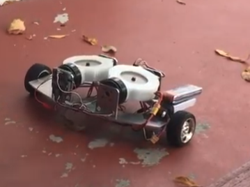
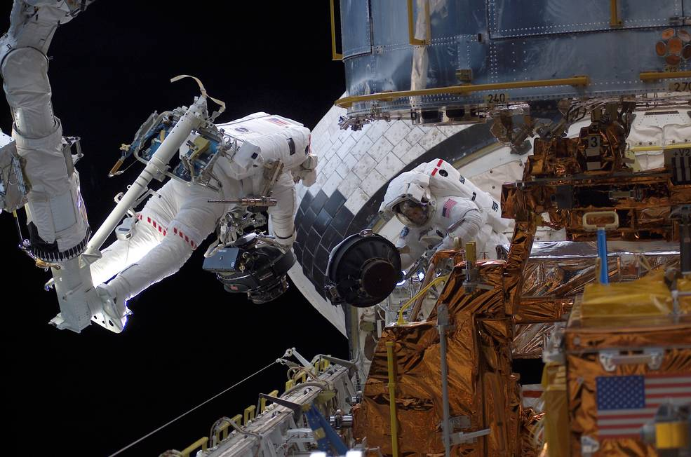

# applications of reaction wheel
Using conservation of angular momentum, the balance of a toy car is controlled by reaction-wheel or control moment gyroscopes widely used in spacecraft attitude control.

https://youtu.be/4gf7wSdj78s

https://www.nasa.gov/content/goddard/hubble-space-telescope-pointing-control-system

Two gyros spinning in opposite direction cancel the uneven terrain caused roll change, which translates to undesired pitch control torque. 

Major design steps are:
- Vehicle body attitude determination, embedded
- brushless motor torque control, embedded
- chassis building, solidworks mechanical design, machining
- flywheel static and dynamic balancing, mechanical
- adaptive estimate of system balance point(forward/backward), embedded
- non-contact angular position feedback, embedded

